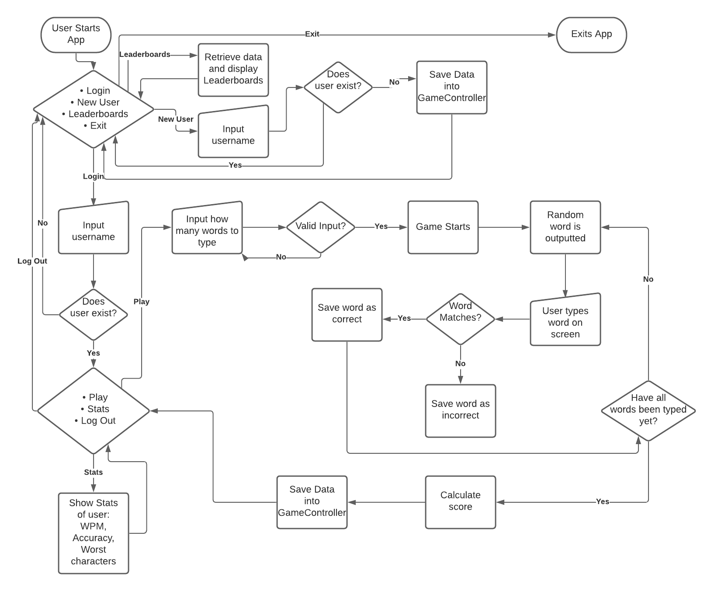

# Source Control repository
    Source code - https://github.com/AnthonyALu/terminal-application
    Ruby Gem - https://github.com/AnthonyALu/typeking

# Ruby Gems
    - Artii - https://github.com/miketierney/artii
    - tty-prompt - https://github.com/piotrmurach/tty-prompt
    - Random-word - https://github.com/openlogic/random-word
    - Colorize - https://github.com/fazibear/colorize

# Software Development Plan

## Description
    This application is a typing game that will allow users to put their typing skills to the test. In this application, the user will first decide how many words they wish to attempt to type. The game will then output random words for the user to type, repeating until reaching the designated number of words that the user jas cjpsem/ After the designated number of words are attempted, the user will be given their results. These results will include typing speed, accuracy and the top 3 letters that they are most unfamiliar with on the keyboard. Registration will be required to allow for multiple users to play the game on the same computer. Users can then compare their typing speeds with the leaderboards function.

## What will it solve?
    In a world where technology is rapidly developing and working from home is very common, there is a high possibility that the average person will need to know how to use a computer. Using a computer will require some basic skills such as typing and navigating with the mouse, but what if a pandemic occurs and someone who is not familiar with the keyboard is forced to work from home? That person will only be able to work as fast as their fingers will allow them to. Touch-typing refers to the practice of using one's fingers to type with a keyboard without using the keys. It is an extremely useful skill to have as it will not only improve productivity but also concentration and general health. This application will help the user with their touch-typing by testing their typing speed and providing feedback on how fast they type and which keys they struggle with most. On the other hand, this application can also be a fun time-waster for competitive people. 

## Target audience
    The target audience consists of students, workers and anyone looking to increase their typing skills. The internet has contributed to the way we communicate and work significantly. Because of this, the target audience is broad as anyone can benefit from learning to type with better speed and accuracy.

## How do I use this application?
    1. Run the application by using the 'run_app.sh' file or by running 'ruby index.rb' in the terminal
    2. Use the keyboard to navigation to 'Register' and press enter
    3. Login using the registered name (case-sensitive)
    4. Press enter on the 'Play' option
    5. Enter how many words you want to type (enter a number from 5-500)
    6. Type the words that appear in the terminal
    7. See results when typing is finished
    8. Play again or log out to check if you have made the leaderboards!

# Features
    - Stores data of multiple users and user registration/login
        - Saves user data each session so that data can be compared with other users. This data will be saved inside a class variable to be accessed to display leaderboards. 
        - Prevents multiple users from using the same username and ensures that each unique user will have their own username and statistics
    - Gameplay - Generates random words for you to type
        - Utilises a randomising Ruby gem to generate random words so that the user won't be able to predict what they are required to type. 
        - Receives input from user to check words typed
        - Receives the user input then stores the data to calculate the user's statistics later.
        - Calculates wpm and accuracy - Wpm will be calculated based on characters per minute then divided by 3. The reason it is divided by 3 is because an average word is about 5 characters and unlike normal typing tests, this application uses very random words and requires the user to press the enter button once a word is completed. This reduces the user's speed by about half as they must stop to process the next word they are given. 
        - Stats of typing test including typing speed and accuracy
        - Returns the typing speed in words per minute and displays how accurate the user is with their words.
        - Tells the user which letters they are the least efficient with
        - Returns the top letters included in words that they have typed incorrectly. 
    - Stats and leaderboards for local users
        - Allows local users to compare scores to see who is faster
        - Shows wpm, accuracy, and least accurate characters for up to 3 users
        - Shows up to 3 users at a time
    
# User Interaction and experience
    - How the user will find out how to interact with / use each feature
        - Login/Register
            - User will be prompted to choose whether to log in or register when the application starts. They will be able to choose the option they want with the arrow keys and enter to confirm their option.
        - Game
            - User will eventually reach a prompt that says 'Play', where they will be able to select it to play the game. 
        - Stats and leaderboards
            - User will see a prompt option for leadboards on the starting screen and a prompt option for stats when they are logged in.
    - How the user will interact with / use each feature.
        - Login/Register
            - Users will use usernames that will hold all their data. By registering a user, a user will be created and stored in the application.
            - Users will then log in with their user accounts to start playing.
        - Game
            - User will first enter how many words they wish to type.
            - User will then see words that are outputted by the application that they must type out exactly and enter into the application as input.
            - User will keep repeating this process until they have reached their designated word count.
        - Stats/Leaderboards
            - User will check stats to find out which letters they can improve on and their words per minute and accuracy.
            - If a user beats their personal record, this data will be saved as their new record.
            - User can check leaderboards for the top scores of local users to compete with others.
    - How errors will be handled by the application and displayed to the user
        - Login/Register
            - If a user attempts to register an account that already exists, the application will tell them that the account already exists by outputting to the terminal.
            - If a user attempts to login with a user that does not exist, the application will tell them that they must register first by outputting to the terminal. 
        - Game
            - If the user attempts to type in an invalid character when asked for how many words they wish to type, the application will tell them to enter a valid character with an example.
        - Leaderboards
            - If the user checks the leaderboards when there are none to show, the application will tell the user that no one has played the game.

# Control Flow Diagram

# Implementation Plan

 - Features
    - Registration
        1. Create User Class that will be responsible for creating new users.
        2. Create GameController Class that will be responsible for storing data of users.
        3. Create a method to allow users to register an account with a username.
        4. Create a method that will attempt registration and to store data if applicable.
        5. Prevent user from registering if an account already exists by checking existing user base.
        6. Create tests and check for errors.
    - Login
        1. Create a method that allows the user to login with a username by checking if it exists in user base.
        2. Prevents user from logging in if the user does not exist.
        3. Accesses use data of current user in GameController Class and make that the current user data.
        4. Allows the user to log out by returning to home screen.
        5. Create tests and check for errors.
    - Gameplay
        1. Create a method to start game by asking user how many words they want to attempt to type.
        2. Generate a random word using a Ruby Gem and output it to the terminal. 
        3. Receives user input and matches it with previous word generated.
        4. Add correct words to an array and incorrect words to a different array. 
        5. Create a method that calculate the statistics when the game finishes.
        6. Calculates Words per Minute of user by using correct word array to find characters typed and normalise it into words per minute.
        7. Calculates accuracy of user by dividing correct words by total words.
        8. Calculates least efficient characters by breaking up incorrect words array and counting incorrect characters.
        9. Saves statistics if the Words per Minute score is higher than the previous score.
    - Leaderboards/Statistics
        1. Create array in Gamecontroller Class that holds all user scores and data.
        2. Sorts user array by descending order under words per minute value. 
        3. Create a hash for each of the top 3 users by words per minute.
        4. Create a method that displays leaderboards for up to 3 users by using if statements to check how many users must be displayed. 
        5. Leaderboard method prints user name, wpm, accuracy and worst character of each user. 
        6. Create a method that shows statistics of user including name, wpm, accuracy and 3 worst characters.
        7. Create tests and check for errors. 

# Help
    - Steps to install the application
        1. Download the source file from the repository - https://github.com/AnthonyALu/terminal-application
        2. Open the Terminal app and navigate to the directory of the file
        3. Type 'ruby index.rb' or run the bash file using 'bash run_app.sh'
    - Steps to install the gem
        1. Install the gem with 'gem install typeking'
        2. Enter IRB in the terminal
        3. Type 'require typeking'
        4. Type 'Typeking::GameController.new()' to start the application
    - Dependencies
        - gem "colorize", "~> 0.8.1"
        - gem "artii", "~> 2.1.2"
        - gem "tty-prompt", "~> 0.23.1"
        - gem "random-word", "~> 2.1.1"

